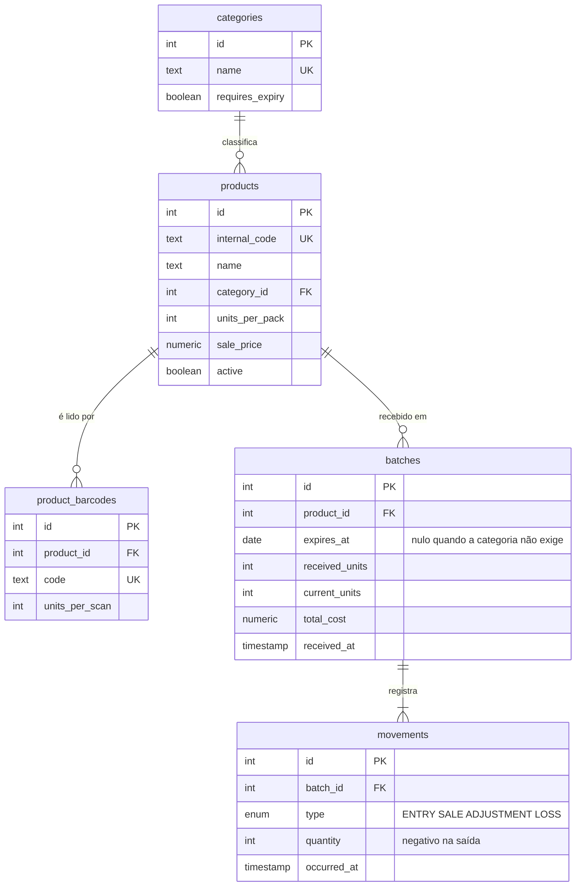

# Controle de estoque para mercearia

API para controle de estoque de uma mercearia de bairro, com rastreio por fardo: validade, custo de compra e saldo. Projeto real — a intenção é o dono usar.

## O problema

Parece cadastro simples: produto, quantidade, pronto. Não é.

O mesmo produto entra na loja várias vezes, em compras diferentes, com **custos diferentes e validades diferentes**. Um campo `quantidade` no produto responde "tenho 30 Coca-Colas" e mais nada. Não responde qual delas vence primeiro, nem quanto foi pago em cada compra — que são justamente as duas perguntas que decidem se a mercearia ganha ou perde dinheiro.

Perda por vencimento e margem errada por custo mal apurado são os dois furos silenciosos de uma loja pequena. O sistema existe para fechá-los.

## O modelo



A cardinalidade entre `batches` e `movements` é **um para um-ou-muitos**, não zero-ou-muitos: um fardo não existe sem a movimentação de entrada que o criou.

**Estoque é a soma dos fardos, nunca uma coluna.** Cada compra cria um fardo com sua própria validade e seu próprio custo. O saldo do produto é agregado a partir deles. Uma coluna `quantidade` seria mais simples e quebraria no primeiro dia em que a pergunta fosse "o que vence essa semana?".

**Movimentação é livro-razão: só cresce.** Entrada, venda, ajuste e perda são lançamentos. Nada de `UPDATE` ou `DELETE` num lançamento — erro de digitação vira um lançamento de ajuste que compensa o anterior. O histórico auditável sai de graça, e permite reconstruir qualquer saldo a partir do zero.

**Compra em fardo, controle em unidade.** A loja compra fardo e vende unidade. Guardar o saldo em fardo faria toda venda virar fração, então a conversão acontece na entrada: o cadastro do produto diz quantas unidades tem um fardo, a entrada aceita sobrescrever — fornecedor muda de 10 para 12 sem avisar — e o estoque é sempre contado em unidade.

**Cadastro é caro e acontece uma vez; operação é barata e acontece toda semana.** Tudo que é estável fica no produto: nome, categoria, códigos, tamanho do fardo, preço de venda. A entrada de mercadoria só referencia o produto e pede o que muda de compra para compra — quantos fardos, qual validade, quanto foi pago.

O critério é o tempo de digitação. Numa nota de oitenta itens, cada campo desnecessário por linha é o que decide se o sistema é usado ou abandonado.

**Um produto tem vários códigos de barras, e cada código sabe quantas unidades representa.** O código da lata e o código do fardo são números diferentes — é assim de propósito, para o depósito bipar caixa e o caixa bipar unidade. Um produto também acumula códigos quando o fabricante troca a embalagem: por meses, estoque velho e novo convivem na prateleira e os dois são válidos. E há produtos sem código nenhum: ovo avulso, pão, item repackado pelo dono.

Duas colunas no produto atenderiam o caso mais comum e quebrariam nos outros três. Então os códigos são uma tabela, e cada linha carrega quantas unidades aquele código vale:

```
7894900011517     1 unidade      lata avulsa
17894900011514   12 unidades     fardo
```

Isso serve nos dois lados do balcão: na entrada, bipar o fardo já significa doze unidades; na venda, o cliente que leva o fardo fechado gera um bipe em vez de doze. O código é único no sistema inteiro — dois produtos com o mesmo número tornariam o bipe ambíguo, o que anularia a razão de existir do leitor.

O código interno continua no produto: é gerado pelo sistema, sempre existe e é sempre um só. Não é código de barras.

**Categoria é atributo do produto, definida uma vez no cadastro.** Lista plana, uma categoria por produto, em tabela e não em valor fixo no código — o dono precisa poder criar "Pet" sem depender de um deploy.

Onze categorias cobrem a loja: Mercearia, Bebidas, Laticínios e frios, Padaria, Hortifruti, Carnes e congelados, Doces e snacks, Limpeza, Higiene pessoal, Bazar e utilidades, Pet.

O critério de nomeação é a prateleira, não a natureza do item: leite condensado é Mercearia, não Laticínios, porque não vai na geladeira.

**A categoria define se a validade é obrigatória.** Laticínios, Padaria, Hortifruti e Carnes sempre vencem; Limpeza, Higiene, Bazar e Pet raramente importam. Em vez de uma marcação que o dono precisa lembrar de fazer produto a produto, a categoria já responde — com possibilidade de sobrescrever no produto quando fugir da regra.

Sem isso, dar entrada em sabão em pó exigiria digitar uma validade que nenhum alerta vai usar.

**Uma entrada, uma validade.** Validade é o que distingue um fardo do outro. Dois fardos comprados juntos que vençam em meses diferentes são duas entradas, não uma.

**Custo mora na compra, preço mora no produto.** São valores de naturezas opostas. O custo é fato de uma compra que já aconteceu: o fardo de fevereiro custou R$ 90, o de março custou R$ 200, e um não substitui o outro. O preço de venda é decisão do dono, sempre a atual — a prateleira tem uma etiqueta só.

O custo é registrado como **total pago**, não como valor unitário. Dividir na hora de calcular evita gravar um arredondamento no banco e propagá-lo por todo relatório.

**Corrigir custo é livre, e é seguro por construção.** Custo alimenta relatório; nunca toca em quantidade. Errar o valor de uma compra distorce a margem apurada e jamais faz surgir ou sumir mercadoria da prateleira. São dois circuitos independentes, e é isso que permite deixar um editável e o outro imutável.

**A verdade é a prateleira, não o banco de dados.** Se o produto está na mão do vendedor, ele existe. O sistema nunca recusa uma venda porque o próprio número diverge — saldo, validade e alerta são estimativas úteis; a mercadoria física é o fato.

Esse princípio resolve, de uma vez, quatro decisões que pareciam independentes:

```
fardo vencido            dá baixa normalmente
produto desativado       continua vendível
saldo insuficiente       vira saldo negativo, não recusa
produto sem remessa      ganha uma remessa vazia para receber a movimentação
```

O sistema pode ficar errado; ele não pode impedir o comércio. Quando diverge, quem corrige é o ajuste de inventário — contagem física virando lançamento.

Uma remessa criada automaticamente tem `received_units = 0` e `total_cost = 0`, então não participa do custo médio ponderado, que é calculado sobre o que foi comprado. E ela se identifica sozinha: consultar `received_units = 0` lista exatamente os produtos vendidos sem nunca terem sido recebidos.

**Baixa pelo fardo que vence primeiro — como convenção, não como verdade.** Aqui está a parte que mais define o sistema.

Um código de barras identifica o **modelo do produto**, não a unidade física: toda lata de Coca tem o mesmo código. Quando o operador passa o leitor, o sistema sabe *o que* saiu, nunca *de qual fardo*. Saber exigiria código serializado por item — existe em medicamento, não em mercearia — ou o operador escolhendo o fardo no caixa, o que trava a fila.

Então o sistema não descobre: ele **decide**. Dá baixa no fardo de validade mais próxima, apostando que a reposição empurra o estoque velho para a frente da prateleira.

A consequência é assumida:

```
Total por produto          exato       entraram 60, saíram 18, tem 42
Distribuição entre fardos  estimado    "restam 12 do fardo de março" é aposta
```

Quando a aposta erra, o erro é sempre para o mesmo lado: o sistema acha que o fardo velho acabou e para de alertar. Ruim — mas melhor que o contrário, porque alerta falso repetido faz o dono ignorar todos os alertas, e aí o sistema inteiro vira enfeite.

Por isso o alerta de vencimento **não é uma afirmação, é um gatilho** para conferir a prateleira. Quem fecha o ciclo é o ajuste de inventário: conta-se o que existe de verdade e a diferença vira lançamento.

## A arquitetura

**Regra de negócio separada da camada HTTP.** Os módulos de domínio não conhecem Express, não recebem `req`/`res` e não sabem o que é código de status. A rota traduz. O critério prático: teste de regra roda sem subir servidor — os atuais levam 3ms.

**O tipo é derivado do schema de validação.** Uma única descrição do formato de entrada, em vez de uma interface e uma validação escritas em paralelo, que dessincronizam sem avisar.

**Erro de API devolve código, não frase.** `{"error": "PRODUCT_NOT_FOUND"}` em vez de texto para humano. O servidor não sabe quem consome nem em que idioma; quem tiver interface decide a redação.

**Quantidade é inteira, dinheiro é decimal.** A loja vende por unidade, então não há fração de produto. Valor é outra história: centavo em ponto flutuante acumula erro de arredondamento, e a divergência aparece semanas depois no faturamento, sem origem rastreável.

**Venda simultânea do último item não pode furar o estoque.** Duas vendas concorrentes que leiam o mesmo saldo e ambas concluam deixam o estoque negativo. A baixa acontece dentro de transação com bloqueio de linha.

## Estado atual

Node com TypeScript executado sem etapa de build, Express, Zod na validação de entrada, Prisma sobre PostgreSQL, Vitest nos testes.

```
GET  /categories                categorias
GET  /products                  catálogo
GET  /products/:id              busca por id
GET  /products/code/:code       código interno ou código de barras
PUT  /products/:id/price        altera o preço de venda
POST /products/:id/batches      entrada de mercadoria
POST /sales                     registro de venda
```

O modelo descrito acima está implementado no Postgres: categorias, produtos com múltiplos códigos de barras, fardos com validade e custo, e o livro-razão de movimentações. A venda é transacional, com bloqueio de linha, baixa pelo fardo de validade mais próxima e chave de idempotência obrigatória.

Log estruturado em JSON por requisição, tratador de erro centralizado, encerramento gracioso em `SIGTERM`, limites de tempo de conexão e de tamanho de corpo, e validação de entrada no limite do domínio — tetos numéricos e formato dos parâmetros, para que entrada malformada vire `400` e não chegue ao banco. Vinte e sete testes e verificação de tipos rodando antes de cada commit.

## No horizonte

Planejado, não construído — registrado aqui porque impõe restrições a decisões que vêm antes.

**Dois clientes: web e mobile.** A web é gestão — relatório de margem, alertas de validade, entrada de nota. O mobile é o balcão — bipar, vender, dar entrada. São operações majoritariamente distintas, mas se sobrepõem na busca por código: o caixa precisa de quatro campos, a gestão precisa de vinte.

**Um BFF por cliente**, em repositório próprio. O monorepo com workspaces daria um commit único para alterações que atravessam os dois lados, mas ao custo de dependências içadas para a raiz — e dependência içada permite importar um pacote que o outro projeto declarou, o que funciona em desenvolvimento e quebra quando cada serviço é implantado sozinho. Para um time de uma pessoa, o custo cognitivo supera o ganho.

O contrato entre eles começa duplicado: o BFF declara a forma do que espera receber. Quando a dessincronização incomodar, o caminho é o núcleo publicar um documento OpenAPI e o BFF **derivar** os tipos dele — mesma ideia do tipo inferido a partir do schema de validação, atravessando a fronteira de rede.

O BFF nunca fala com o banco: ele fala com o núcleo por HTTP. Se um dia precisar de acesso direto ao Postgres, é sinal de que ganhou regra de negócio — coisa que não deveria ter.

### Duas restrições que o mobile impõe

**Contrato de API deixa de ser livre para mudar.** Aplicativo instalado não se atualiza por decisão do servidor: a versão que está no celular continua chamando a API por meses. Renomear ou remover um campo passa a ser evento planejado, com versionamento, e não uma alteração barata como hoje.

**Venda precisa ser idempotente.** Mercearia com internet instável e cliente esperando no balcão significa que o aplicativo vai enfileirar vendas e reenviar. Se a rede cair depois de o servidor gravar e antes de a resposta chegar, o reenvio grava a mesma venda de novo e o estoque diverge.

A solução é o cliente gerar um identificador único por venda e o servidor recusar repetição — na prática, uma coluna com restrição de unicidade na tabela de movimentações. Decidir isso antes custa uma coluna; descobrir depois custa reconciliar estoque real.

## Dívida conhecida: testes de integração

A suíte cobre duas coisas — a decisão do FEFO e o formato do corpo da venda. São os dois módulos que não tocam nada externo, e por isso rodam em milissegundos.

Tudo que depende do banco está **sem cobertura automatizada**: as consultas, as rotas e seus status, a validação dos parâmetros, a transação da venda, a idempotência e o seed. Foi tudo verificado à mão, uma vez, e nada disso volta a ser verificado sozinho.

O caso mais grave é o **teste de concorrência**. Ele existiu como script descartável e provou o que nenhum outro prova: sem `SELECT ... FOR UPDATE`, quinze vendas simultâneas leem o mesmo saldo e todas descontam do mesmo fardo, que vai a −9 enquanto o fardo seguinte fica intocado. O saldo e o livro-razão continuam concordando, então nada denuncia o erro — o que quebra é a alocação por validade, em silêncio.

É a parte mais difícil do sistema e a única sem rede de proteção.

Quando for feito, fica em suíte separada: `npm test` continua rápido e sem dependências, e a integração roda contra um Postgres descartável, limpando entre casos.

## Próximos passos

- Testes de integração, começando pelo de concorrência
- Ajuste de inventário e alertas de vencimento e estoque baixo
- Relatório de margem sobre custo médio ponderado
- Frontend e BFF, definidos a partir das telas reais
- Autenticação por operador, projetada já para dois serviços
- Alerta de vencimento por e-mail

## Convenções

As regras de código do projeto — estilo, Clean Code, Twelve-Factor e segurança — estão em [ENGINEERING.md](ENGINEERING.md).
